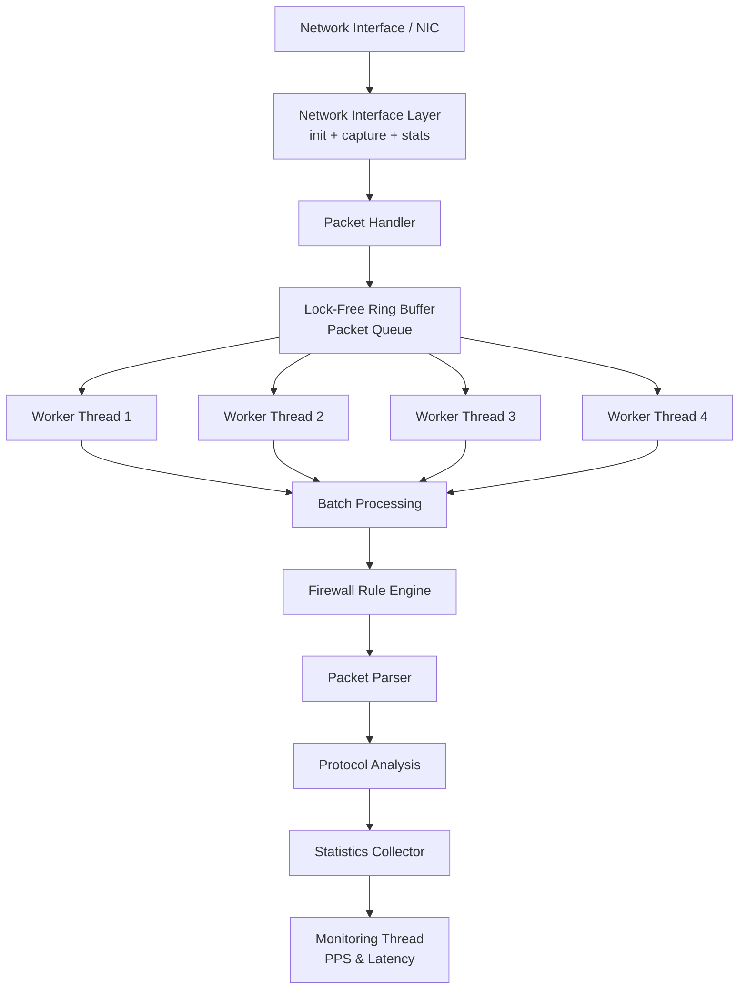

# Packet Processing Architecture

This architecture simulates a layered networking system similar to real-world packet processing engines, separating the network interface layer from the processing pipeline.

