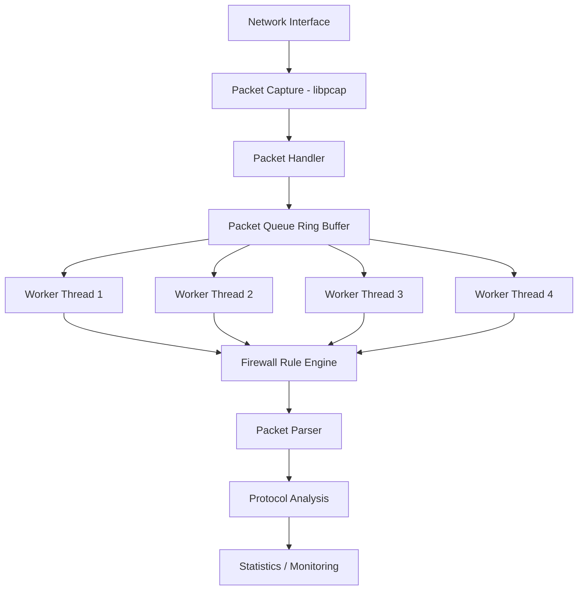

# Packet Processing Architecture

```mermaid
flowchart TD

A[Network Interface] --> B[Packet Capture - libpcap]

B --> C[Packet Handler]

C --> D[Packet Queue Ring Buffer]

D --> E[Worker Thread 1]
D --> F[Worker Thread 2]
D --> G[Worker Thread 3]
D --> H[Worker Thread 4]

E --> I[Firewall Rule Engine]
F --> I
G --> I
H --> I

I --> J[Packet Parser]

J --> K[Protocol Analysis]
K --> L[Statistics / Monitoring]
```